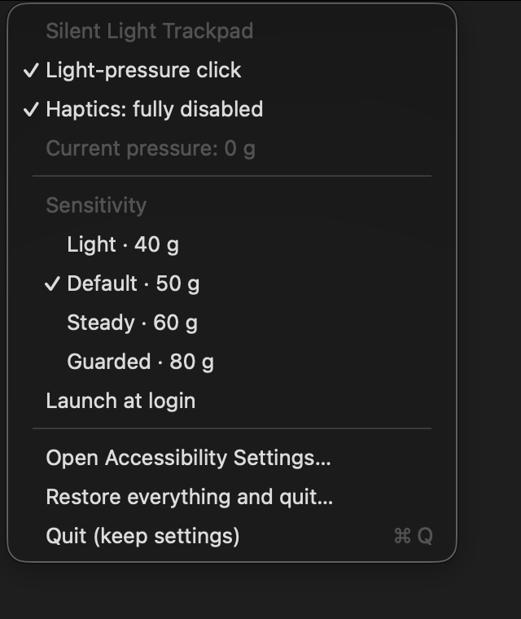
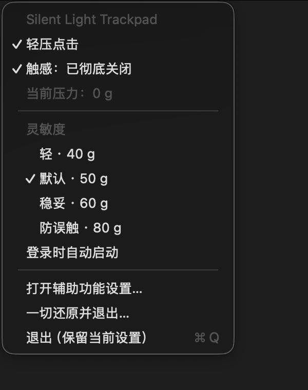

# Silent Light Trackpad

**Disable MacBook trackpad haptic feedback and tune click pressure on macOS.**

Silent Light Trackpad is a small, local menu bar app for people who want a truly silent Force Touch trackpad without giving up pressure-based clicking. It turns off the built-in haptic actuator, reads raw trackpad pressure, and generates a normal left click at your chosen threshold.

Apple’s stock click takes too much force, and the linear actuator keeps kicking back into the fingertip—after a long session, it honestly feels like a fast track to synovitis or tenosynovitis.

[中文说明](#中文说明)



## Features

- Fully disables the built-in trackpad haptic feedback (the click vibration).
- Keeps pressure-based click and drag working without the haptic click.
- Offers approximate 40 g, **50 g (default)**, 60 g, and 80 g display presets.
- Re-applies the haptic setting after wake.
- Supports English and Chinese menus based on the system language.
- Runs locally with no analytics, network service, or account.
- Provides an explicit **Restore everything and quit** command.

| Preset | Displayed pressure | Intended feel |
| --- | ---: | --- |
| Light | 40 g | Very easy to trigger |
| Default | **50 g** | Light but resistant to casual brushing |
| Steady | 60 g | More deliberate |
| Guarded | 80 g | Strongest protection against accidental clicks |

## Why not just use macOS settings?

macOS exposes a “Force Click and haptic feedback” option, but it does not provide a way to keep a custom pressure-based click while fully silencing the actuator. Tap to click is silent, but it is a different gesture and can trigger during light touches. This app keeps an actual pressure threshold and lets you choose how light it should be.

## Requirements

- A MacBook with a built-in Force Touch trackpad
- macOS 15 or newer
- Accessibility permission, used only to intercept and generate mouse events
- Swift 6.2 or newer to build from source

The current version has been tested on a MacBook Air (Mac17,4) running macOS 26.5.2. Other Force Touch MacBooks are expected to work, but are not yet part of the tested matrix.

## Download

[Download the Apple Silicon app](https://github.com/ruodou233/silent-light-trackpad/releases/latest/download/Silent-Light-Trackpad-macOS-arm64-unnotarized.zip)

The package is ad-hoc signed and not notarized. On first launch, macOS may require **System Settings → Privacy & Security → Open Anyway**; then enable the app under **Accessibility**.

## Build from source

```bash
git clone https://github.com/ruodou233/silent-light-trackpad.git
cd silent-light-trackpad
./build-app.sh
open "dist/Silent Light Trackpad.app"
```

On first launch, allow the app in **System Settings → Privacy & Security → Accessibility**, then reopen it. The hand icon in the menu bar opens all controls.

## Restore behavior

Regular **Quit (keep settings)** leaves haptic feedback disabled. The app remembers the original “Tap to click” value before temporarily disabling it to prevent duplicate clicks.

Choose **Restore everything and quit…** to:

1. Restore haptic feedback.
2. Restore the original “Tap to click” value.
3. Disable launch at login.
4. Reset the saved pressure preset to 50 g.
5. Quit the app.

Every restored setting is read back or checked. If any step fails, the app stays open, reports the item that failed, and keeps the saved restore information so you can retry.

## Important limitations

- This project uses Apple’s private `MultitouchSupport.framework` to control the actuator. It cannot be distributed through the Mac App Store and a macOS update may break it.
- The current implementation targets the built-in/default trackpad, not an external Magic Trackpad.
- While active, the app disables the system “Tap to click” preference to avoid duplicate clicks. Use **Restore everything and quit…** to put that preference back exactly as it was.
- Avoid clicking an external mouse at the exact moment a pressure click is held on the trackpad; macOS exposes both through the same global mouse-event stream.
- The values shown as `g` are practical raw-pressure display thresholds, not physical gram measurements calibrated across MacBook models.
- The build script uses ad-hoc signing. A locally built copy may need Accessibility permission again after rebuilding.

## How it works

- [OpenMultitouchSupport](https://github.com/Kyome22/OpenMultitouchSupport) reads raw touch and pressure data.
- Apple’s private `MultitouchSupport.framework` controls the built-in haptic actuator.
- A Core Graphics event tap suppresses the native click sequence and emits left-button events at the selected pressure threshold.

OpenMultitouchSupport is MIT-licensed. Full dependency notices are included in [THIRD_PARTY_NOTICES.md](THIRD_PARTY_NOTICES.md) and copied into every locally built app. This project is released under the [MIT License](LICENSE).

---

## 中文说明

**彻底关闭 MacBook 触控板震动（触感反馈），同时保留可调力度的轻压点击。**

Silent Light Trackpad 是一个纯本地 macOS 菜单栏工具。它会关闭 Force Touch 触感马达，读取触控板原始压力，并在达到设定阈值时生成正常的左键点击和拖拽。

苹果官方点击又重，线性马达还震得手指难受，用久了真有种要得滑膜炎、腱鞘炎的感觉。



### 主要功能

- 彻底关闭内置触控板的点击震动／触感反馈。
- 保留有压力门槛的点击，不把轻划误判成点击。
- 四档近似显示力度：40 g、**50 g（默认）**、60 g、80 g。
- 睡眠唤醒后自动重新关闭触感。
- 菜单随系统语言显示中文或英文。
- 无账号、无遥测、无后台联网服务。

### 下载安装

[下载 Apple Silicon 安装包](https://github.com/ruodou233/silent-light-trackpad/releases/latest/download/Silent-Light-Trackpad-macOS-arm64-unnotarized.zip)

安装包使用临时签名、未经 Apple 公证。第一次打开如果被阻止，请前往 **系统设置 → 隐私与安全性 → 仍要打开**，随后在 **辅助功能** 中允许应用。

### 从源码构建

```bash
git clone https://github.com/ruodou233/silent-light-trackpad.git
cd silent-light-trackpad
./build-app.sh
open "dist/Silent Light Trackpad.app"
```

第一次启动时，请前往 **系统设置 → 隐私与安全性 → 辅助功能** 允许应用控制点击，然后重新打开应用。

普通的 **退出（保留当前设置）** 不会重新开启震动。需要恢复系统原状时，选择 **一切还原并退出…**；确认后，它会恢复触感、恢复原来的“轻点来点按”、关闭登录自启、把下次默认力度重置为 50 g，然后退出。

每一项恢复都会回读或检查。任何一步失败时，应用不会退出，并会保留恢复依据供再次尝试。

### 注意

- 本项目使用 Apple 私有 API，不能上架 Mac App Store，macOS 大版本更新也可能导致失效。
- 当前针对 MacBook 内置 Force Touch 触控板，不保证支持外接 Magic Trackpad。
- 应用运行期间会暂时关闭系统“轻点来点按”，以免产生重复点击；“一切还原”会准确恢复接管前的原值。
- 按住触控板压力点击的同一瞬间，请避免同时点击外接鼠标；macOS 会把两者暴露在同一条全局鼠标事件流中。
- 界面中的 `g` 是便于选择的原始压力近似显示值，并非跨 MacBook 机型校准后的物理克数。
